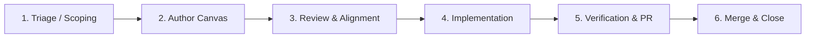

# Issue Canvases Framework

The **Issue Canvases Framework** provides standardized, living engineering templates for designing, triaging, and executing technical work in StellarYield.

---

## 🧭 Why Issue Canvases?

Complex decentralized finance (DeFi) protocols require precision across smart contracts, database models, backend indexers, and user interfaces. Free-form issue tickets frequently omit critical details—such as mathematical invariants, storage TTL policies, authorization checks, and zero-downtime migration plans.

**Issue Canvases solve this by providing:**
- **Predictable Structural Hierarchy**: Uniform H1–H4 headings across every issue archetype.
- **Explicit Invariant Assertions**: Formalizing mathematical and access-control boundaries before writing code.
- **Standardized GitHub Callouts**: Visual alerts (`> [!NOTE]`, `> [!TIP]`, `> [!IMPORTANT]`, `> [!WARNING]`, `> [!CAUTION]`) that surface non-obvious assumptions and security risks.
- **Copy-Pasteable Verification Commands**: Clear validation matrices that mirror CI pipelines.

---

## 🗂️ Canvas Taxonomy & Comparison

| Canvas Type | Primary Target | Key Invariants / Focus Areas | Template Location |
| :--- | :--- | :--- | :--- |
| **[Feature & Epic Canvas](./templates/issue-canvases/feature-canvas.md)** | Full-stack features & yield strategies | Yield conservation, cross-layer API & contract design, user personas, UI snapshots | `docs/templates/issue-canvases/feature-canvas.md` |
| **[Bug Investigation Canvas](./templates/issue-canvases/bug-investigation-canvas.md)** | Regressions, discrepancies & defect triage | 5-Whys root cause analysis, invariant breach assessment, minimal reproduction | `docs/templates/issue-canvases/bug-investigation-canvas.md` |
| **[Smart Contract Canvas](./templates/issue-canvases/contract-invariant-canvas.md)** | Soroban contracts, fees & math | Storage TTL lifetimes, `require_auth()` access matrix, checked math, gas profiling | `docs/templates/issue-canvases/contract-invariant-canvas.md` |
| **[Architecture & Refactor Canvas](./templates/issue-canvases/architecture-refactor-canvas.md)** | System refactoring & schema migrations | Zero-downtime Prisma migrations (expand/contract), backward compatibility, load testing | `docs/templates/issue-canvases/architecture-refactor-canvas.md` |
| **[Security Remediation Canvas](./templates/issue-canvases/security-remediation-canvas.md)** | Vulnerability fixes & threat mitigation | Attack vector walkthrough, CVSS blast radius, defense-in-depth, exploit tests | `docs/templates/issue-canvases/security-remediation-canvas.md` |
| **[Contributor Task Canvas](./templates/issue-canvases/contributor-task-canvas.md)** | Scoped contributor & Stellar Wave tasks | File paths, step-by-step implementation guide, local verification commands | `docs/templates/issue-canvases/contributor-task-canvas.md` |

---

## 📐 Heading & Structure Standards

All canvas documents adhere to the following heading conventions:

1. **Title (H1)**: Single H1 declaring the canvas category and item title (`# [Canvas Type]: [Title]`).
2. **Metadata Table (H2)**: Uniform table recording canvas type, issue number, author, milestone, status, risk rating, and workspace dependencies.
3. **Core Specification (H2/H3)**: Architectural context, technical designs, user flows, and diagrams.
4. **Invariants & Constraints (H2)**: Mathematical formulas, access boundaries, and safety invariants.
5. **Verification & Testing (H2)**: Local commands and CI matrix for test execution.
6. **Acceptance Criteria (H2)**: Checklists defining the completion criteria and definition of done.

---

## 📢 Callout Semantic Standards

Canvases use GitHub Flavored Markdown alerts to emphasize critical information:

| Callout Syntax | Visual Meaning | Proper Usage in Canvases |
| :--- | :--- | :--- |
| `> [!NOTE]` | ℹ️ Background Context | Linking related issues, milestone context, and roadmap items |
| `> [!TIP]` | 💡 Helpful Tip | Toolchain commands, debugging shortcuts, and gas optimization advice |
| `> [!IMPORTANT]` | 📌 Crucial Invariant | Mathematical conservation laws, non-negotiable protocol constraints |
| `> [!WARNING]` | ⚠️ Breaking Warning | Backward-incompatible API changes, dual-write migration windows |
| `> [!CAUTION]` | 🚨 High Risk / Security | Private key safety, exploit risks, fund loss vectors, emergency pause |

---

## 🔄 Issue Canvas Lifecycle Workflow

### 1. Triage & Scoping
- Maintainers or contributors identify a new feature, defect, contract task, or architectural refactor.
- Choose the matching canvas template from `docs/templates/issue-canvases/` or GitHub issue templates.

### 2. Author Canvas
- Fill in the overview metadata, problem statement, technical architecture, and invariants.
- Keep the canvas in `Draft` status during initial scoping.

### 3. Review & Alignment
- Solicit review from maintainers and domain experts (e.g. smart contracts, security, UI).
- Resolve open questions and update invariants before writing code.

### 4. Implementation
- Create a dedicated feature branch following repository naming conventions (e.g., `feat/issue-1123-issue-canvases`).
- Implement the changes adhering strictly to the constraints outlined in the canvas.

### 5. Verification & PR
- Execute local verification commands specified in the canvas.
- Attach UI snapshots if frontend was modified.
- Open a Pull Request referencing the issue and canvas (`Fixes #1123`).

### 6. Merge & Close
- Ensure all acceptance criteria in the canvas checklist are validated in CI.
- Merge PR and update protocol documentation as needed.

---

## 🔗 Related Resources

- **[Style Guide & Specification](./templates/issue-canvases/README.md)**
- **[Contributor Guide](./contributor-guide.md)**
- **[Maintainer Triage Process](./triage-process.md)**
- **[Incident Postmortem Template](./INCIDENT_POSTMORTEM_TEMPLATE.md)**
- **[Emergency Runbook](./EMERGENCY_RUNBOOK.md)**
